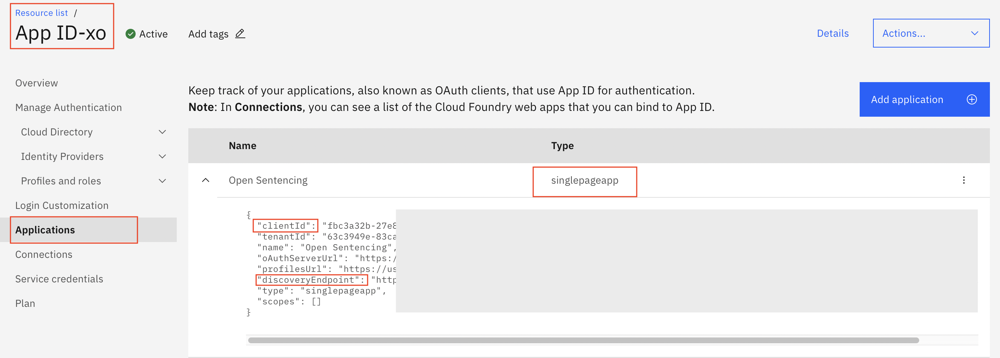

# Open Sentencing User Interface (UI)

[](https://www.apache.org/licenses/LICENSE-2.0) [](https:callforcode.org/slack) [](https://call-for-code-for-racial-justice.github.io/Hacktoberfest/#/?id=main)

The User Interface (UI) provided is meant to allow public defenders or others an ability to easily review contents of a case to determine when bias was detected. Since public defenders are so busy we wanted this to be an item that could be utilized very quickly and easily. No knowledge of the programming behind the tool is needed for an end user.

The Open Sentencing UI is part of the overall Open Sentencing tool.  
Check out the main GitHub repo for more information:
Call for Code for Racial Justice - Open Sentencing: https://github.com/Call-for-Code-for-Racial-Justice/Open-Sentencing.

## Contents

- [Contents](#contents)
- [Getting started](#getting-started)
  - [High-fidelity prototype](#high-fidelity-prototype)
  - [Prerequisites](#prerequisites)
  - [Installing](#installing)
  - [Configure the application](#configure-the-application)
  - [Run the application](#run-the-application)
  - [Containerize the application](#containerize-the-application)
  - [Unit tests](#unit-tests)
  - [Coding style tests](#coding-style-tests)
- [Built with](#built-with)
- [Contributing](#contributing)
- [Versioning](#versioning)
- [Authors](#authors)
- [License](#license)
- [How to Help _We'd love your involvement!_](#how-to-help-wed-love-your-involvement)

## Getting started

These instructions will get you a copy of the project up and running on your local machine for development and testing purposes. See deployment for notes on how to deploy the project on a live system.

### High-fidelity prototype

The [Invision Prototype](https://ibm.invisionapp.com/share/Q5O0KIVUNE8#/screens) shows what we're currently implementing.

### Prerequisites

1. [Node.js](https://nodejs.org/en/) 10 or above
2. [Angular CLI ](https://angular.io/cli). Last tested with 12.2.1.
3. [IBM App ID service](https://cloud.ibm.com/catalog/services/app-id)

### Installing

1. Clone or download the [GitHub repository](https://github.com/Call-for-Code-for-Racial-Justice/Open-Sentencing-UI).
1. Change directory to `Open-Sentencing-UI/web`.
1. Run `npm install` to install all the packages.

### Configure the application

Fill out the App ID credentials in `web/src/app/services/appid-authentication.service.ts`. You can obtain the values from the `Service credentials` tab on the main page of your service instance.



- CLIENT-ID: clientId
- DISCOVERY-ENDPOINT-URL: discoveryEndpoint

```
this.appid.init({
      // REPLACE with credentials from IBM CLOUD APPID Service
      clientId: '<CLIENT-ID>',
      // REPLACE with credentials from IBM CLOUD APPID Service
      discoveryEndpoint: '<DISCOVERY-ENDPOINT-URL>'
    });
```

### Run the application

1. Change directory to Open-Sentencing-UI/web
2. Run `npm start` to start the application on port `8080`.

### Containerize the application

You can choose your own image name and tag, such as `os-ui:oct18`. The `.` at the end represents the location for the new image. You can also choose your own container name.

- `docker build -t <image name> .`
- `docker run --rm --name <image name> -p 8080:8080 <container name>`
  example:
- `docker build -t os-demo:oct19 .`
- `docker run --rm --name os-ui -p 8080:8080 os-demo:oct19`

### Unit tests

Run the Following command:

- `ng test`

### Coding style tests

Run the following command:

- `ng lint`

## Built with

- Angular

## Contributing

Please read [CONTRIBUTING.md](https://github.com/Call-for-Code-for-Racial-Justice/Open-Sentencing/blob/master/CONTRIBUTING.md) for details on our code of conduct, and the process for submitting pull requests to us.

## Versioning

We use [SemVer](http://semver.org/) for versioning. For the versions available, see the [tags on this repository](https://github.com/your/project/tags).

## Authors

- Kandarp Thakar
- Xinzhan Lin
- Max Veit
- David Nugent
- Jean Carlos Ricardo Arruda

## License

This project is licensed under the Apache 2 License - see the [LICENSE](LICENSE) file for details.

## How to Help _We'd love your involvement!_

Please visit our main repo here: https://github.com/Call-for-Code-for-Racial-Justice/Open-Sentencing. More detailed areas on where we need assistance are provided.
If you would like to [Help](https://developer.ibm.com/callforcode/racial-justice/) with the cause to use technology to battle racism, we would love for you to get involved! Please submit updates to us for review.
Together we can use technology to fight systemic racism!
